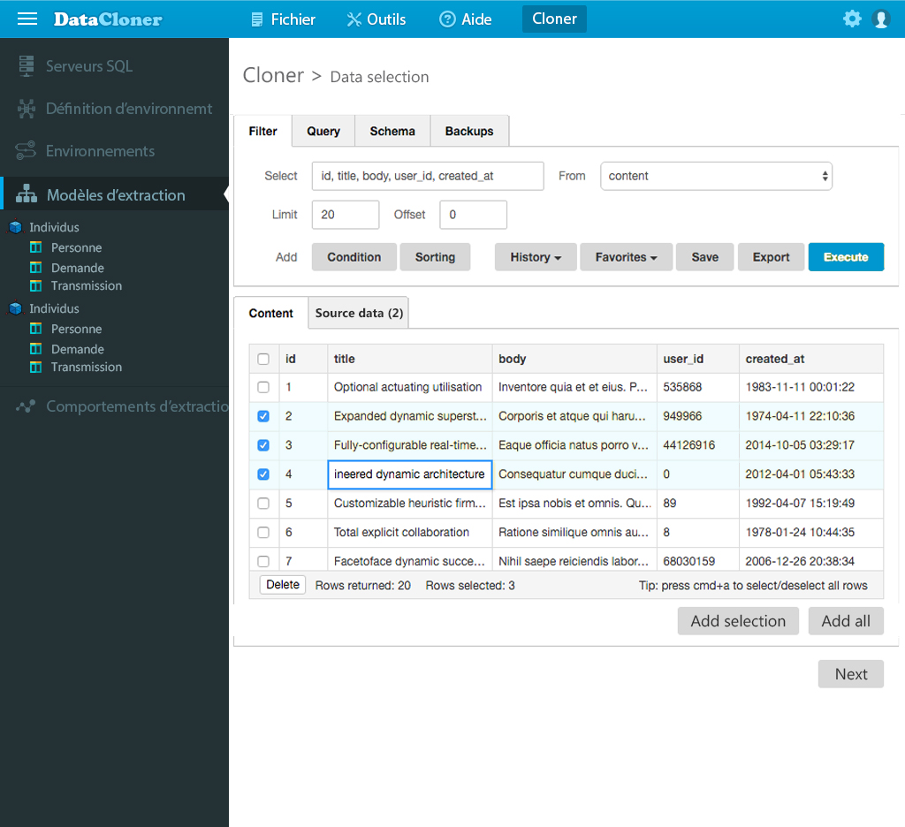

# DataCloner
Tool (API/GUI) for cloning SQL data precisely. Starting rows with their dependencies and their derivatives.

## Overview

It is a software whose core is composed of a recursive algorithm which is based on a starting line of a database to go to recover all the dependencies and derived from it. In the end, it is an integral record that can be saved in a file for future loading or can be executed directly into a database with the same table structure.

## Who is the application for?

* To all companies doing development and having a database.
* For all developers, analysts and pilots testing production problems.
* For developers wanting to automate test domains to reduce ridiculously amount of time.
* For DBAs
 
## Options

* Duplication between databases. The copy can be made in the same db or an external one.
* Support cloning between multi-server source and destination. For systems based on a multitude of databases.
* Save / load the resultset to / from a file. To recharge data during testing.
* Backup Point. Restoration of records due to data evolution.
* Multiple backup points for the same dataset. Allows you to load a case at a specific step. (Shapshot)
* Configurable joins between tables in databases /servers.
* Can Load with or without derivatives data.
* Load one to multiple lines from one to several starting tables.
* Usable in command line.
* Jamming of sensitive data.
* Support of similar source / destination tables (plus or minus columns).

## .NET Core - API use example

```cs
//Minimal configuration
var project = new Project()
{
    ConnectionStrings = new List<Connection>
    {
        new Connection{ Id = "UNI", ProviderName = "System.Data.SqlClient", ConnectionString =@"Data Source=(localdb)\MSSQLLocalDB;Integrated Security=True;"}
    }
};

//Creating an execution plan for reuse later
var builder = new ExecutionPlanBuilder(project, null);

builder.Append(new RowIdentifier
{
    ServerId = "UNI",
    Database = "Chinook",
    Schema = "dbo",
    Table = "Customer",
    Columns = new ColumnsWithValue { { "CustomerId", 1 } }
});

//Creating a mew clone of the data inside the database.
var query = builder.Compile();
query.Execute();
```

## Windows 10 - UWP GUI


